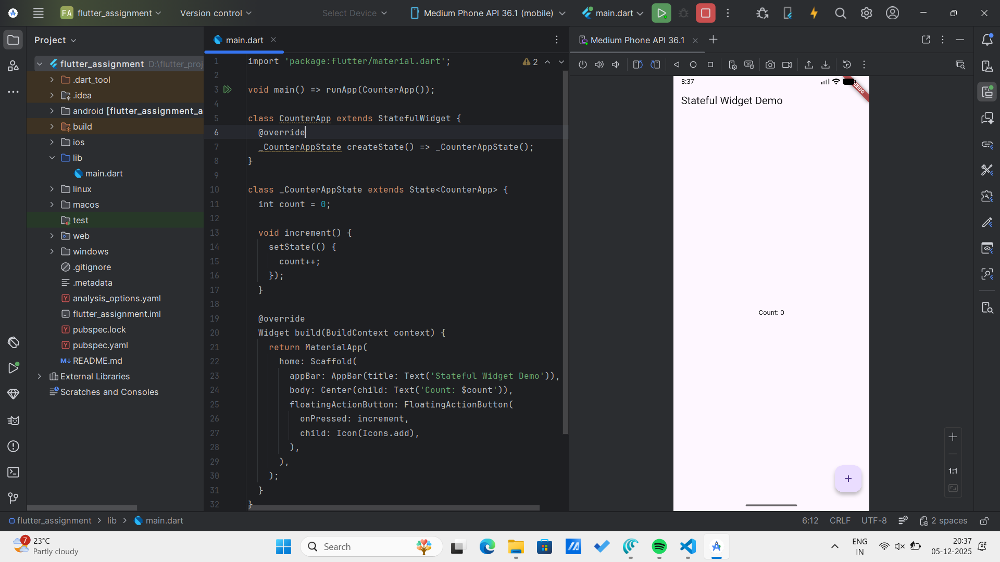

# Flutter Reactive UI Assignment

## 1. Difference Between StatelessWidget and StatefulWidget

### StatelessWidget
- A widget that does **not change** once it is built.
- Used for static UI elements like text, icons, and buttons that don’t update automatically.

### StatefulWidget
- A widget that **can change over time** based on user interaction or data updates.
- Uses a separate `State` class and updates the UI using `setState()`, triggering a rebuild of affected widgets.

---

## 2. How Flutter Uses the Widget Tree to Build Reactive UIs

Flutter builds UIs using a **widget tree**, where each widget describes part of the interface.  
When the state changes, calling `setState()` tells Flutter to:

- Rebuild only the widgets that depend on that changed state
- Update the UI efficiently without redrawing the entire screen

This reactive mechanism allows Flutter to create fast and smooth interfaces.

---

## 3. Why Dart Is Ideal for Flutter’s Design Goals

- Dart compiles to **native ARM** code, giving high performance on mobile.
- Supports **Hot Reload**, speeding up development.
- Designed with a **UI-first approach**, making layout and animations easy.
- Null safety helps reduce bugs.
- Fast, lightweight, and optimized for reactive frameworks like Flutter.

---

## 4. Screenshot of Demo App

